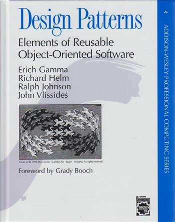

# **Marp**

Markdown Presentation Ecosystem

https://marp.app/

---

# How to write slides

Split pages by horizontal ruler (`---`). It's very simple! :satisfied:

```markdown
# Slide 1

foobar

---

# Slide 2

foobar
```

---


---


---


# How to live with monsters.

A guide for surviving OOP.

---


# I hate OOP because it is anti real code.

---

# I hate OOP because it leads to violence.

